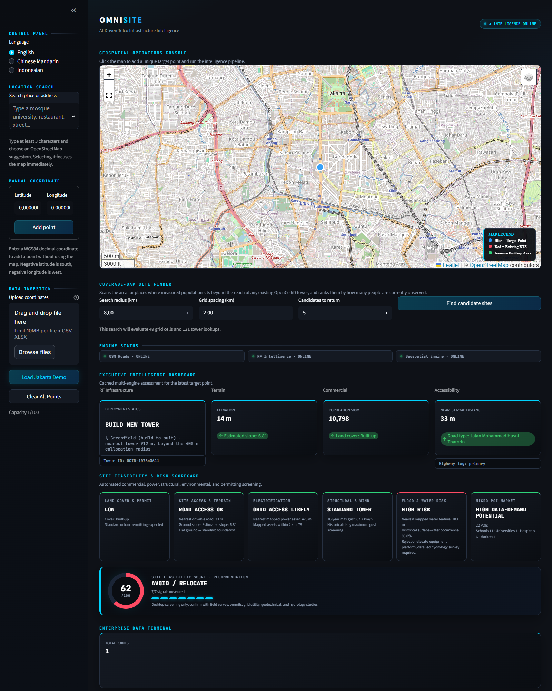

# OmniSite — AI-Driven Telco Infrastructure Intelligence

[](https://github.com/nandaisnanda/OmniSite-AI-Driven-Telco/actions/workflows/ci.yml)


[](https://share.streamlit.io/deploy?repository=nandaisnanda%2FOmniSite-AI-Driven-Telco&branch=main&mainModule=app.py)

Desktop screening for telco tower placement. Click a point on the map — or upload up to
100 surveyed coordinates — and OmniSite runs five public-data engines concurrently to
answer the questions a site-acquisition team asks first: *is there already a tower here,
can a crew reach it, will it flood, what tower class does the wind history demand, and
are there enough people nearby to justify the build?*



## What it does

| Capability | How |
|---|---|
| **Per-site feasibility scorecard** | 7 measured signals → 0–100 score → `PROCEED / REVIEW / AVOID` verdict |
| **RF deployment call** | OpenCelliD tower inventory → collocation vs. greenfield, with the rule spelled out |
| **Coverage-gap site finder** | WorldPop demand vs. tower supply over a search grid — ranks locations by *unserved* population, not raw headcount |
| **Unsupervised site segmentation** | K-means (k chosen by silhouette) + Isolation Forest over measured ground conditions |
| **Batch screening** | Upload CSV/XLSX, every point analysed on a background worker pool, exportable scorecard |
| **Trilingual UI** | English · 中文 · Bahasa Indonesia — 267 keys per language, parity enforced by tests |

**Data engines** (all public): OpenStreetMap/Overpass (roads, POIs, power, water) ·
OpenCelliD (cell towers) · Google Earth Engine (SRTM elevation/slope, ESA WorldCover,
WorldPop population, VIIRS night lights, JRC surface water) · Open-Meteo (10-year wind
gust archive, elevation fallback).

## The design decision this project is really about

Public data sources fail constantly — quotas, timeouts, dead mirrors. The easy failure
mode is to score what you have and stay silent about what you don't. An early version of
this scoring did exactly that: with **every** engine down it returned **82/100 —
PROCEED TO SURVEY**, because each unmeasured signal silently counted as a passed one.

The current policy treats *unknown* as a first-class state:

- A signal no engine could measure carries **no penalty and no credit** — it is shown as
  `NOT SCREENED`, never green.
- Fewer than 4 of 7 signals measured → the app **refuses to issue a score** (`INSUFFICIENT DATA`).
- Any unmeasured signal caps the verdict at `CONDITIONAL REVIEW` — a thin pass is never
  an approval, because the missing signal may be exactly the one that fails the site.
- The same rule applies upstream: the coverage-gap finder refuses to rank sites when the
  tower inventory is incomplete, because a partial inventory makes covered ground look
  like a gap.

The regression tests in [`tests/test_scoring.py`](tests/test_scoring.py) pin this
behaviour down.

## Quick start

```bash
python -m venv .venv
source .venv/bin/activate        # Windows: .venv\Scripts\activate
pip install -r requirements.txt

cp .streamlit/secrets.toml.example .streamlit/secrets.toml
# then edit .streamlit/secrets.toml — see Configuration below

streamlit run app.py
```

Runs without any credentials, in degraded mode: RF intelligence reports *not
configured*, the geospatial engine falls back to public elevation only, and most sites
will honestly report `INSUFFICIENT DATA` rather than a fabricated score.

## Configuration

All keys can also be set as environment variables (env wins). See
[.streamlit/secrets.toml.example](.streamlit/secrets.toml.example) for the full,
commented list.

| Key | Purpose | Default |
|---|---|---|
| `OPENCELLID_API_KEY` | Tower inventory (RF verdicts, gap finder) | unset → degraded |
| `GEE_SERVICE_ACCOUNT_FILE` | Earth Engine service-account JSON path | `apigee.json` |
| `AUTH_ENABLED` / `AUTH_MODE` / `APP_PASSWORD` | Optional gate: shared password (`session`) or Streamlit-native OIDC (`oidc`); fails closed if misconfigured | auth off |
| `RATE_LIMIT_ANALYSIS_PER_MINUTE` | Per-session analysis budget | `10` |
| `RATE_LIMIT_RECOMMEND_PER_MINUTE` | Per-session gap-finder budget | `3` |
| `MAX_QUEUED_JOBS` / `JOB_TIMEOUT_SECONDS` | Background worker limits | `50` / `150` |
| `OMNISITE_LOG_LEVEL` (env only) | `DEBUG`…`ERROR` | `INFO` |

## Quality gates

```bash
pip install -r requirements-dev.txt

ruff check .        # lint — clean
mypy app.py         # types — clean
pytest --cov        # 97 offline tests: scoring policy, geometry, quota budgets,
                    # header detection, i18n parity across all three languages
```

The suite is offline by design; `test_ml.py` is a separate manual diagnostic that runs
the real pipeline against live services. CI (GitHub Actions) runs lint, types, tests,
a Docker build, an advisory dependency audit, and a check that no credential file is
ever tracked by git.

## Deploy on Streamlit Community Cloud

[](https://share.streamlit.io/deploy?repository=nandaisnanda%2FOmniSite-AI-Driven-Telco&branch=main&mainModule=app.py)

> **Set Python to 3.13 under Advanced settings before deploying.** Community Cloud now
> defaults to 3.14, and numpy, pandas, shapely and scikit-learn publish no cp314 wheels at
> the versions pinned here. Deploying on 3.14 makes pip build shapely from source, which
> fails on a missing `geos-config` and missing numpy headers — the app then never starts
> and the URL serves "your app is waking up" indefinitely, with the real cause visible
> only in the deploy log. The Python version cannot be changed after the app is created;
> a mis-set app has to be deleted and redeployed.

Point a new app at `app.py` on `main`, then paste your credentials into
**Settings → Secrets** using the same TOML shape as
[.streamlit/secrets.toml.example](.streamlit/secrets.toml.example):

```toml
OPENCELLID_API_KEY = "your-key-here"
AUTH_ENABLED = "true"
APP_PASSWORD = "choose-a-long-random-passphrase"
```

Two deployment-specific notes:

- **Turn authentication on.** A public Streamlit URL with `AUTH_ENABLED = "false"` lets
  any visitor spend your OpenCelliD and Earth Engine quota.
- **Earth Engine needs a file, not a string.** `GEE_SERVICE_ACCOUNT_FILE` expects a path
  on disk, and Community Cloud has nowhere to put a gitignored key — so the geospatial
  engine runs in its public-elevation fallback there. Use Docker or any host with a
  writable filesystem for a deployment with Earth Engine fully enabled.

## Docker

```bash
docker compose up --build
# or
docker build -t omnisite . && docker run -p 8501:8501 omnisite
```

Mount your Earth Engine key read-only and pass `OPENCELLID_API_KEY` via environment —
see [docker-compose.yml](docker-compose.yml).

## Architecture notes

A deliberate single-module Streamlit app ([app.py](app.py)) plus an offline test suite.
Structure inside the module: i18n tables → settings/auth/rate-limit → five engine
clients (each returning `available`/`error` alongside its data, cached with TTL and
entry caps) → a pure scoring policy → UI. Engines run concurrently on a
`ThreadPoolExecutor`; results are harvested for every queued point so batch uploads
fill in without being opened one by one. Interesting corners:

- **Quota as a first-class constraint** — the gap-finder's search radius is capped at
  exactly the tile budget (121 OpenCelliD lookups), the Earth Engine grid is batched at
  150 features/request, and the UI states the cost of a search *before* the button is
  pressed. Tests pin every reachable UI setting inside those budgets.
- **Failure attribution** — "quota exhausted", "no tower here", and "could not check"
  are three different states with three different UI treatments; conflating them is how
  covered ground becomes a phantom coverage gap.
- **Honest fallbacks** — when Earth Engine is unreachable the fallback reports elevation
  only and *nothing else*, rather than a plausible-looking constant.

## Limitations

Desktop screening only — results must be confirmed by field survey, permitting review,
grid-utility assessment, and geotechnical/hydrology studies. OpenCelliD coverage is
crowdsourced and incomplete; absence of a tower in the data is evidence, not proof.

## License

[MIT](LICENSE)
